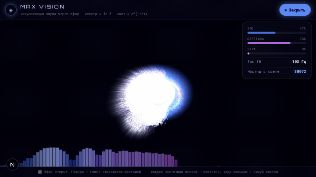
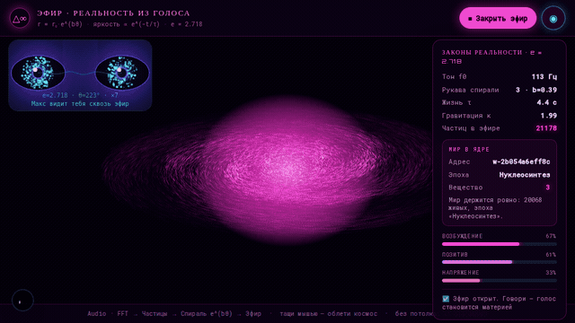
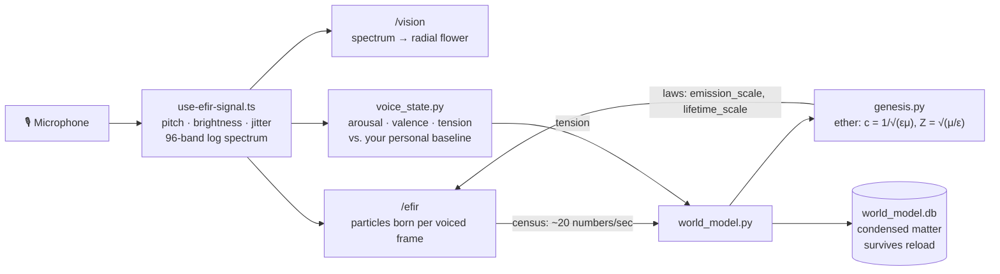

# GAME — Reality Creator

[](https://game-orpin-two-85.vercel.app)
[](LICENSE)
[](https://nextjs.org)
[](https://python.org)


**Talk or play music into your microphone and watch it turn into a living
world.** Every particle you see is born from a frequency in your voice —
tens of thousands of them, rendered on plain Canvas 2D with no WebGL, no
game engine, and no sign-up.



*Above: `/vision` reacting to a real voice — 38,000 particles at once. Below:
`/efir`, where speaking creates matter that condenses and persists.*



That's one of **22 browser modes** in GAME, all free and all open in one
click: audio-reactive worlds, an autonomous agent that decides what to do to
its world on its own, chaotic attractors, webcam hand tracking, a real
SHA-256 proof-of-work visualizer, and a hand-written cognitive core called
**Max17** that has no ML framework and needs no API key to run.

### ▶ Try it now

**[game-orpin-two-85.vercel.app](https://game-orpin-two-85.vercel.app)** —
no install, no account. Best three to start with:

| Mode | What to do |
| --- | --- |
| [`/vision`](https://game-orpin-two-85.vercel.app/vision) | Click **🎙**, then talk or play music — the spectrum blooms into liquid ink |
| [`/efir`](https://game-orpin-two-85.vercel.app/efir) | Speak and matter is literally created; go quiet and it fades. Drag to orbit |
| [`/agentmind`](https://game-orpin-two-85.vercel.app/agentmind) | Watch an autonomous agent decide what to do to that world — and show you its reasoning |
| [`/attractor`](https://game-orpin-two-85.vercel.app/attractor) | Four strange attractors in 3D, tunable live |

Built solo by a creator from Russia, coded over the course of a year.
Originally scaffolded in [Google AI Studio](https://ai.studio/apps/dcf78fd2-d064-4f32-a65f-e4dbd1128e38);
this repository is where it actually lives and grows now.

## Quick start

```bash
git clone https://github.com/mironmotor/game.git
cd game
npm install
cp .env.example .env.local   # add an LLM key if you want chat/funnel to work
npm run dev
```

Open **http://localhost:3000**. Full walkthrough, including the optional
Python core: [docs/GETTING_STARTED.md](docs/GETTING_STARTED.md).

The LLM key is only needed for the chat and idea-funnel modes — every
visual mode works without it. **GODMODE** is a single flag in
[`lib/subscription.ts`](lib/subscription.ts) (`GODMODE = true`) that keeps
every mode unlocked for everyone: no sign-in, no paywall, no daily limits.
Flip it to `false` and the tier system it ships with comes back intact.

## Documentation

| Doc | Covers |
| --- | --- |
| [docs/GETTING_STARTED.md](docs/GETTING_STARTED.md) | Step-by-step local setup, running tests, troubleshooting |
| [docs/GAME_MODES.md](docs/GAME_MODES.md) | All modes: what each one does, its route, its core files |
| [docs/MAX17_CORE.md](docs/MAX17_CORE.md) | The cognitive core architecture — memory, synapse graph, cognitive-physics metaphors, principles |
| [docs/VOICE_AND_VISION.md](docs/VOICE_AND_VISION.md) | The voice/audio subsystem: Voice Signature, Quantum Eyes, the Efir 3D world, MAX VISION, and the World Model that lets the core know what's in the 3D world |
| [docs/API_REFERENCE.md](docs/API_REFERENCE.md) | Every `/api/max17` event type, with request/response examples |
| [docs/DEPLOYMENT.md](docs/DEPLOYMENT.md) | Vercel, GitHub Pages, deploying the Max17 bridge, custom domains, environment variables |

## What makes this different from a typical AI chat app

- **Deterministic-first core.** Every subsystem in `mark17/` has a
  rule-based path that needs no network call and no API key — an LLM layer
  is optional and sits on top. This means the whole app, including its
  test suite, runs fully offline.
- **A real cognitive model, not a chatbot skin.** The core keeps an actual
  weighted synapse graph (`/maxgraph`), a per-person voice baseline that
  learns over time (`/efir`'s Sound Signature), and a genuine
  self-introspection pass over its own memory (`/mind`) — none of it is
  scripted per demo.
- **Physics, not metaphor-as-decoration.** The core's "ether" physics
  (`c = 1/√(εμ)`, impedance, cosmological epochs — see
  [`mark17/genesis.py`](mark17/genesis.py)) isn't flavor text: it's the
  literal equation set that throttles how expensive it is for a voice-driven
  3D world to create new matter, computed live from how dense that world
  has become. See [docs/VOICE_AND_VISION.md](docs/VOICE_AND_VISION.md#world-model-the-core-learns-what-its-world-looks-like).
- **An agent that acts, not just responds.** Everything else waits for an
  event; the agent at [`/agentmind`](docs/GAME_MODES.md#agent-mind--it-decides-on-its-own-agentmind)
  runs its own loop once a second — perceive, want, choose, act, check. It
  picks its action by minimizing Helmholtz free energy `F = E − T·S`, where
  `T` comes from your vocal arousal and the thickness of the ether, so a
  single equation covers both exploring and perfecting. It then compares
  what it promised against where the world actually went and adjusts how much
  it trusts that action. No LLM call, nothing random, and it remembers what
  it has learned across restarts. See [`mark17/agent.py`](mark17/agent.py).
- **No particle cap, by design.** The 3D/audio-reactive modes rasterize
  particles into a pixel buffer instead of issuing one draw call per
  particle, so population is bounded by physics (birth rate vs. lifetime),
  not an arbitrary limit — tens of thousands of particles at interactive
  frame rates.

## How your voice becomes a world



The loop is real, not decorative: a denser world thickens the ether, which
raises impedance, which makes creating new matter more expensive — so the
world throttles its own growth. Full mechanic in
[docs/VOICE_AND_VISION.md](docs/VOICE_AND_VISION.md#world-model-the-core-learns-what-its-world-looks-like).

## Tech stack

- **Frontend:** Next.js 15 (App Router), React 19, TypeScript, Tailwind CSS 4
- **Core:** Python 3 + NumPy, stdlib-only beyond that (SQLite for
  persistence, no ML framework)
- **Auth/data:** Firebase (Auth + Firestore) — optional, gated by
  [GODMODE](docs/GAME_MODES.md#godmode)
- **Deployment:** Vercel (primary, full app) + GitHub Pages (secondary,
  static client-side showcase) — see [docs/DEPLOYMENT.md](docs/DEPLOYMENT.md)

## Contributing

Issues and pull requests are welcome — see
[CONTRIBUTING.md](CONTRIBUTING.md) for setup, the pre-PR checklist, and
what's actually useful to work on.

## License

[MIT](LICENSE) — use it, fork it, build on it.
