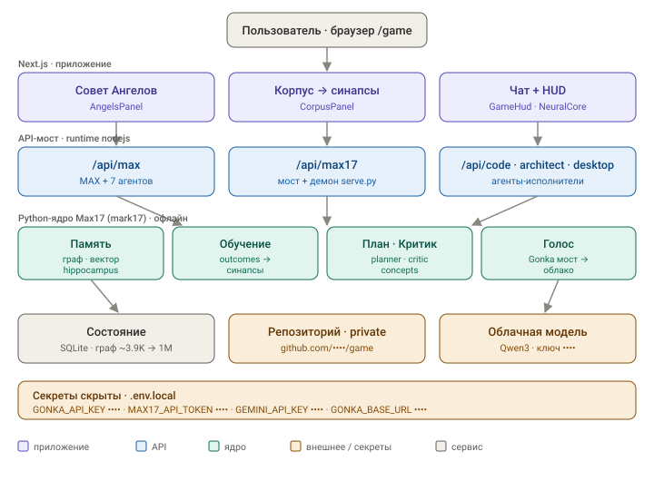

# Архитектура

Две половины, связанные тонким мостом.



> Диаграмма ([`architecture.svg`](architecture.svg)) — ключи/токены и владелец репозитория замаскированы (`••••`).

```
┌─────────────────────────── Next.js (TypeScript, React 19) ───────────────────────────┐
│  app/            маршруты и страницы (basePath /game)                                  │
│   page.tsx       → HudApp + AngelsPanel + CorpusPanel                                  │
│   classic/       → GameApp (классический UI)                                           │
│   api/*/route.ts → серверные эндпоинты (runtime nodejs)                                │
│  components/     HUD, Совет Ангелов, Корпус, визуализации                              │
│  lib/            клиенты, оркестратор агентов, утилиты                                 │
│  hooks/          useGameState (задачи/XP в localStorage, кросс-инстанс синхрон)        │
└───────────────────────────────────────────────────────────────────────────────────────┘
                    │ HTTP /game/api/max17  (события)        │ HTTP /game/api/max (Совет)
                    ▼                                          ▼
┌──────────────────────────── Python-ядро mark17 (Max17) ───────────────────────────────┐
│  serve.py         персистентный демон: один процесс на воркер, держит numpy+SQLite     │
│  json_cli.py      диспетчер событий + one-shot мост (фолбэк)                            │
│  hippocampus.py   keyword-память (SQLite)        vector_memory.py  семантическая память │
│  neural_graph.py  граф синапсов (путь к 1M)      outcome.py        обучение на исходах  │
│  gonka_bridge.py  облачный голос (Qwen3)          web_sense.py      web-факты            │
│  + concepts, consolidation, planner, critic, dreamer, music_sense, self_state, …        │
└───────────────────────────────────────────────────────────────────────────────────────┘
```

## Поток запроса

### Чат с MAX (HUD)
1. HUD шлёт событие `user_message` на `POST /game/api/max17`.
2. Роут (`app/api/max17/route.ts`) пишет в **демон** (`mark17/serve.py`); если демон недоступен —
   фолбэк на one-shot `mark17/json_cli.py`. Таймаут-бюджеты: cold ~45с, warm ~30с.
3. Ядро классифицирует намерение (`mark17/orchestrator.py::classify`):
   - `code`/`desktop` с уверенностью ≥0.6 → короткое замыкание `_dispatch_result` → ответ с
     `dispatch:{route,instruction}`; HUD открывает код/desktop-режим и отдаёт задачу агенту.
   - иначе → полный когнитивный проход (память, план, концепты, голос Gonka) → текстовый ответ.

### Совет Ангелов (панель)
1. Панель шлёт `POST /game/api/max` (см. [03-council-agents](03-council-agents.md)).
2. `MaxOrchestrator` греет контекст (память+исходы), гоняет 7 агентов, синтезирует ответ,
   при необходимости уходит в deep (Gonka), берёт задачи в работу.

## Связь TS ↔ ядро
- `lib/max17-client.ts` — браузерный клиент: `sendMax17Event`, `sendCodeAgent`, `sendArchitect`,
  `sendDesktopAgent`, `getLlmConfig`/`setLlmModel`, basePath-aware `getApiPath`.
- `lib/max17-memory-store.ts` — серверный `MemoryStore` поверх ядра (события `memory_recall`/`memory_store`).
- `lib/max17-llm.ts` — серверный `LlmCaller` поверх ядра (событие `llm_raw`, Gonka).
- `app/api/max17/max17-daemon.ts` — клиент персистентного демона (FIFO очередь, респаун).

## Карта приложения (ключевое)
```
app/
  page.tsx                 / → HudApp + AngelsPanel + CorpusPanel
  classic/page.tsx         /classic → GameApp
  layout.tsx               шрифты, метаданные, тема
  api/
    max17/route.ts         главный мост к ядру (события)
    max17/max17-daemon.ts  персистентный демон
    max/route.ts           эндпоинт Совета (MAX + 7 агентов)
    code/route.ts          code-агент (пишет файлы в песочнице)
    architect/route.ts     architect-агент (предлагает ветки разработки)
    desktop/route.ts       desktop-агент (управление рабочим столом)
    llm-config/route.ts    выбор LLM-модели в рантайме
components/
  AngelsPanel.tsx          Совет Ангелов (оркестратор в UI)
  CorpusPanel.tsx          ингест корпуса + дашборд роста
  GameApp.tsx              классический UI
  hud/                     HudApp, GameHud, NeuralCore, консоли, фоны, музыка снов, …
lib/
  agents/                  ядро системы MAX+7 (см. 03-council-agents)
  max17-client.ts, max-orchestrator-client.ts, max17-memory-store.ts, max17-llm.ts, jarvis-voice.ts
hooks/
  use-game-state.ts        задачи/XP/сессии в localStorage + событие game:tasks-sync
mark17/                    Python-ядро Max17 (см. 02-max-core)
docs/                      эта документация
```
